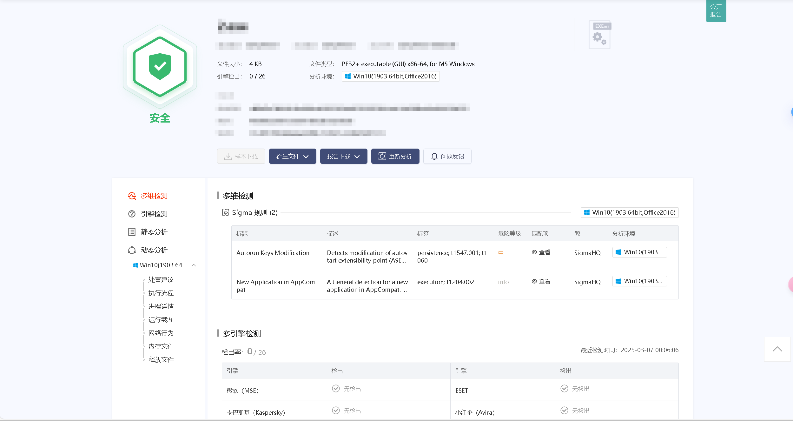

# NJUPT_Fastlogin 

由于之前使用python写的南邮校园网登录脚本速度太慢了,而且缺点众多,所以我使用`C`重写了**船新版本**.理论上只要是`GET包`的登录请求都可以使用这个脚本,只需要修改一下`URL`的数据即可.

## 优点
1. 快到起飞,经测试最快的版本`version2_ASM.cpp`平均耗时 **8.430ms** 
2. 在挂梯子的情况下也可以正常使用,原因是直接使用的是`IP地址`,节省了`DNS解析`~~(南邮的DNS解析就是一坨)~~
3. 代码依赖少,没有使用任何第三方库,只依赖了`C`和`汇编`
4. **安卓**直接去下`Release版本`开箱即用

## 缺点
1. 因为是`C`写的代码,所以你需要编译后才能使用.
2. 每次更换`账户密码`你都需要`修改源码`,然后重新编译(这样是为了硬编码账户密码到程序中`加快速度`)
3. 由于以上原因,所以本项目不可能提供`Release版本(安卓除外)`,只能提供源码,请自行编译.
4. (有可能出现的问题)由于`p.njupt.edu.cn`的域名解析后的`IP`被硬编码在程序中,所以如果`IP`变了,那么程序就会完全失效.

## 版本
1. `version1_API.cpp` 使用windows的底层`API`函数实现的版本,速度慢`1ms`左右
2. `version2_ASM.cpp` 使用`汇编`实现的版本,速度最快
3. `version2_ASMcross.cpp`和`version2_ASMcross.cpp`是全平台版本,可以在`Windows`和`Linux`以及`MacOS`上完成编译正常运行. **推荐不知道选哪个的用这个**
4. `Android v1.5`是安卓版本请前往Release下载
> [!NOTE]
> `version1`和`version2`的所有版本默认都在是`clang`编译器下测试。不保证在msvc下能正常编译通过，如果你的电脑只安装过`VS Studio`，请创建一个新的项目，然后把`version3_ASMall.cpp`的代码复制进去编译。

## 关于运营商
| WIFI名称 | NJUPT     | NJUPT-CMCC | NJUPT-CHINANET |
| -------- | --------- | ---------- | -------------- |
| 运营商   | 校园网    | 移动       | 电信           |
| @后缀    | **去除@** | CMCC       | njxy           |

## 使用方法
**详细视频教程(点击图片前往B站)**    
Android:    
[](https://www.bilibili.com/video/BV1MuRWY4Ema/)


Windows & Linux & MacOS:      
[](https://www.bilibili.com/video/BV1MuRWY4E2b/)

---

### Android
1. 下载Release中的apk文件
2. 安装后按照提示输入账号密码\选择对应运营商
3. Enjoy it!
---
### Windows && Linux
1. 需要准备:
    - Windows: Clang/GCC 或者 VS Studio
    - Linux: Clang/GCC
2. 拉取源码:  
`git clone https://github.com/lux-QAQ/NJPUT_Fastlogin.git`
1. 修改源码:  
    - 打开`version2_ASMcross.cpp`(这里选择你需要的版本即可,推荐这个)
    - **按照注释**修改`#define USERNAME "你的账户"`
    - **按照注释**修改`#define PASSWORD "你的密码"` 
2. 使用注释中对应的指令编译源码

> 如果编译过程有问题请发Issue,我会尽快解决   
> 如果你不会编译可以联系我`QQ:1098346640`~~仅限妹子~~,我有时间会尽力帮助你
## 可能会继续补充的功能
- [x] Windows 支持
- [x] Linux   支持
- [x] MacOS 支持
- [x] Android 支持
- [ ] 使用配置文件
- [ ] IPv6 登录的支持
- [ ] 单线多播的支持
- [ ] 考虑适配其他学校

## 性能测试
``` shell
D:\test3\njuptnet>performance_test.exe                                                                                     
========== 性能测试开始 ==========                                                                                         
每个程序将运行 1000 次

测试 version1_API.exe...
成功运行次数: 1000/1000        

测试 version2_ASM.exe...
成功运行次数: 1000/1000        

========== 测试结果 ==========
version1_API.exe 总运行时间: 9.265 秒
version2_ASM.exe 总运行时间: 8.322 秒

version1_API.exe 平均运行时间: 9.265 毫秒/次
version2_ASM.exe 平均运行时间: 8.322 毫秒/次

version2_ASM.exe 比 version1_API.exe 快 1.11 倍

测试完成，按任意键退出...
```

## 简单的原理解析
南邮的校园网登录实际上就是一个`GET`请求,携带用户名和密码. 点击登录按钮就等于直接把构造好的这个`GET`请求发送到服务器. 但是默认的域名为`p.njupt.edu.cn`,这个域名会被解析成一个`IP地址`,然后再发送请求. 但是这个解析过程会消耗时间,而且南邮的DNS服务器非常慢,所以我们直接把`IP地址`硬编码在程序中,这样就省去了`DNS解析`的时间. 另外,使用`C`语言和`汇编`可以最大限度地减少程序的依赖。

## 安全性
登录软件的行为和病毒非常相似:
1. 体积小
2. 不需要安装和交互
3. 后台静默运行
4. 会自动发送数据

由于以上原因,程序非常容易被杀毒软件误报.但是源码是开源的,有没有恶意代码,你看源码就知道了.    
**这里附上安全性检测结果:**


## 免责声明
1. 本项目仅供学习交流使用,请勿用于非法用途.任何后果自行承担.
2. **本项目的通信没有使用`SSL`加密,请慎重考虑确保安全后使用,其后果自行承担.**
3. 本项目的代码开源,请自行查看代码.

## License

This project is licensed under the Creative Commons Attribution-NonCommercial 4.0 International License. You can view the full license [here](LICENSE).
根据该License严禁将该项目用于任何商用目的。任何人将该项目商用所获取的任何非法利益与本项目无关。


